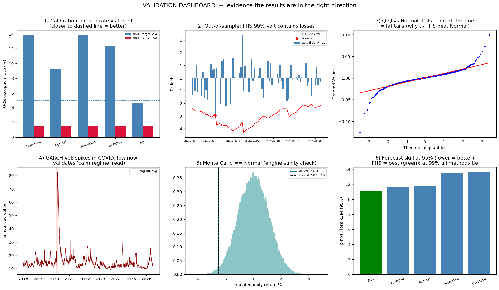
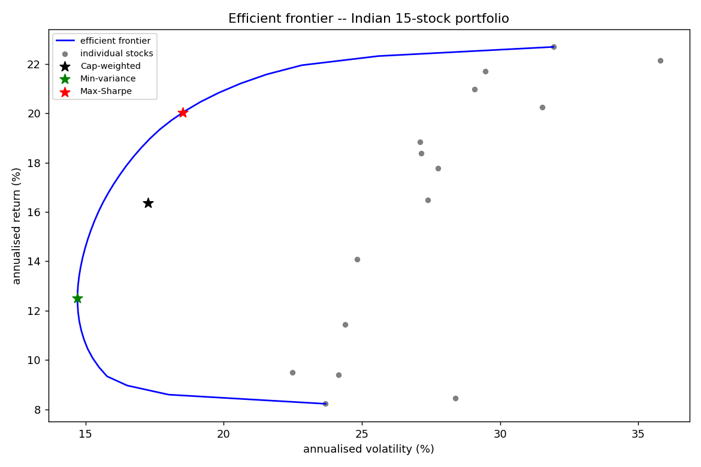
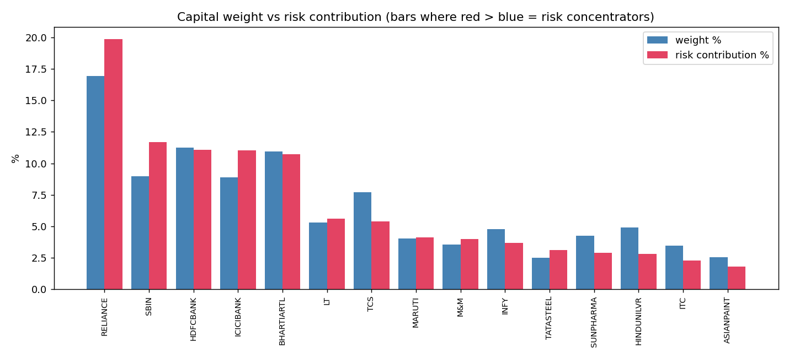
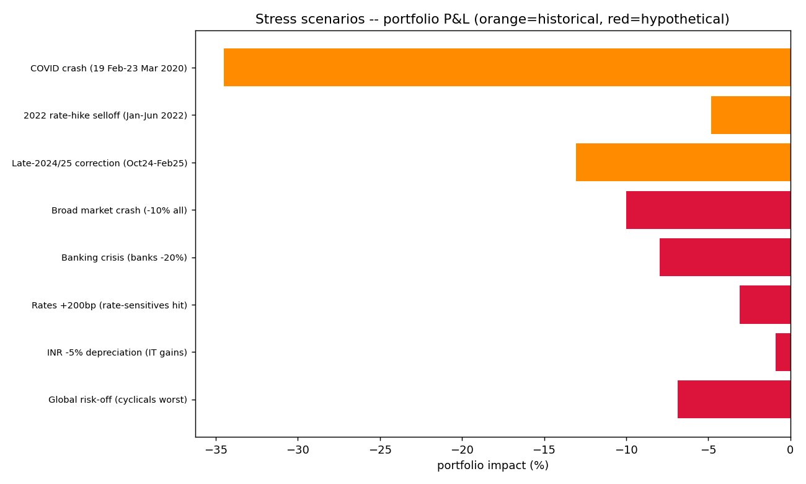
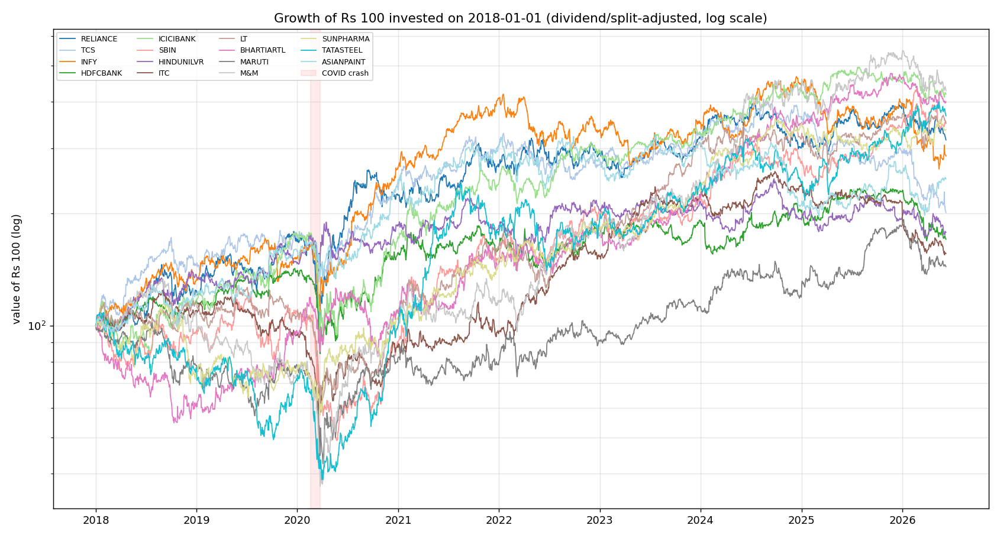

# 📉 Indian Equity Portfolio — VaR / CVaR Risk Engine

> **How much could a ₹1 crore portfolio of Indian large-caps lose in a bad day / bad week — and can we *prove* the answer is right?**

An end-to-end **Value-at-Risk (VaR)** and **Conditional VaR / Expected Shortfall (CVaR)** engine for a 15-stock, market-cap-weighted Indian equity portfolio. It implements **six estimators**, validates them with a proper out-of-sample backtest, turns the numbers into **decisions** (what to trim, how much capital to hold, how to rebalance), and reports the **uncertainty** on every estimate. All figures in **₹ (INR)**.

  

---

## 🎯 Headline findings (live data → 8 Jun 2026)

- **A naïve Gaussian model under-states the real tail loss (1-week 99% CVaR) by ~38%** — because Indian equity returns are fat-tailed (excess kurtosis **+17.5**, skew **−0.66**). Gaussian risk is dangerously optimistic.
- **Filtered Historical Simulation (FHS) is the only model calibrated at *both* 95% and 99%** out-of-sample — verified with Kupiec, Christoffersen and Dynamic-Quantile tests.
- **Stress testing reveals what VaR can't:** a COVID-style month would lose **~₹35–41 lakh — about 8× the weekly VaR.** Risk *measurement* ≠ crisis *resilience*.
- **Diversification benefit = 37.4%**; SBIN carries **30% more risk than its weight** (a concrete trim/hedge signal).
- The **99% CVaR could be ₹3 L or ₹6.6 L** purely from sample noise (bootstrap CI) — so tail numbers should never be quoted to false precision.

## ✅ Validation dashboard — *evidence the model is sound*



Calibration (right breach rate) · out-of-sample containment · fat-tail Q-Q · GARCH regime tracking · Monte-Carlo engine check · forecast-skill ranking.

---

## 🧮 Methods (each removes one false assumption from the previous)

| Method | Assumes | Captures |
|---|---|---|
| Historical simulation | future ≈ past | real fat tails (non-parametric) |
| Parametric Normal | Gaussian returns | fast closed form (under-states tails) |
| Parametric Student-t | fat-tailed *t* (MLE) | fat tails |
| Monte Carlo | multivariate-Normal assets (Cholesky, 100k sims) | full covariance structure |
| GARCH(1,1)-t | volatility clusters | **conditional (today's) risk** |
| **Filtered Historical Simulation** | GARCH vol × **empirical** residuals | time-varying vol **+** real tail shape |

Backtested with **Kupiec POF**, **Christoffersen**, **Dynamic Quantile**, **pinball / Lopez loss**, **Basel traffic-light**, and **QLIKE** for the volatility forecast.

## 🧭 From measurement to decisions (Tier-1 add-ons)

| Module | Decision it drives |
|---|---|
| **Component / Marginal VaR** | which holding to trim/hedge |
| **Stress testing** | crisis resilience & capital buffer |
| **Markowitz frontier** | better risk-adjusted allocation |
| **Bootstrap CIs** | how much to trust the number |

<p align="center">
  
  
</p>
<p align="center">
  
  
</p>

---

## 🚀 Run it

```bash
pip install -r requirements.txt
python 01_download_data.py     # downloads + saves the datasets (Yahoo Finance)
python 03_run_analysis.py      # train, forecast today, backtest, charts
python 06_fhs.py               # Filtered Historical Simulation (best model)
python 12_validation_plots.py  # the validation dashboard above
# 04 scorecard · 05 predicted-vs-actual · 07 decomposition · 08 stress · 09 markowitz · 10 bootstrap · 11 plots
```

## 🗂 Structure

```
config.py              single source of truth (tickers, weights, dates, params)
utils.py               rupee formatting + data loading
01_download_data.py    data acquisition + dataset build
02_risk_models.py      core library (VaR/CVaR/GARCH/FHS/backtest stats)
03..12_*.py            analysis stages (forecast, backtest, decomposition, stress, frontier, validation)
data/                  prices, returns, weights, portfolio P&L (CSV)
outputs/               CSV results + charts
```

## 📚 What this demonstrates

Probability & stochastic processes (Monte Carlo, GARCH), statistical inference (MLE, hypothesis-test backtesting, bootstrap), quantitative finance (VaR/CVaR, coherent risk measures, mean-variance optimization), and applied rigour (calibration, out-of-sample validation, uncertainty quantification). Crucially: **risk modeling is *estimation + calibration*, not supervised "predict-a-label" ML** — and the project is built to show that distinction.

## ⚠️ Limitations

Constant (rebalanced) weights, no transaction costs; √t horizon scaling assumes i.i.d. returns; survivorship bias (only currently-listed names); CVaR backtesting is harder than VaR (VaR coverage tested here).

## 📄 License

MIT — see [LICENSE](LICENSE). Educational project; **not** investment advice.
